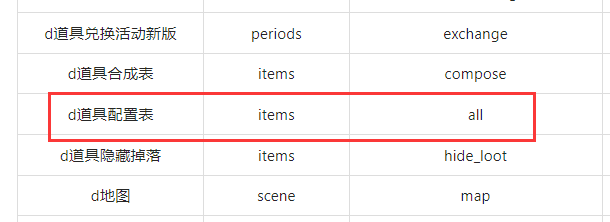

# 打包流程

1. 由策划提供需要更新的配置表以及有改动的代码模块(如果包含离散表，需问清策划离散表包含哪些模块)。

2. 找到配置表在代码中相应的模块以及有改动的模块，模块间由","分隔。

**Item,LootPackage,Periods.LimitShop,Periods.Tuan,Periods.FireworkCelebration,Periods.FireworkRank,Periods.Config**

## 2_1

在<http://192.168.1.170:8081/my2/config-mapping>的md文件中找到配置表在代码中的路径。

## 2_2

找到所有需更新的模块后，按照依赖关系对模块进行排序，比如掉落模块依赖物品模块,所以物品模块应该先于掉落模块更新。

3. 访问内网打包网址<http://192.168.1.23:8000/>，根据相应的改动选择相应的服务器（realm、world...）,选择相应的分支（develop、release...）,等打包完成后用ftp推送到相应的分支。

4. 最后将打包记录发送给运营。

